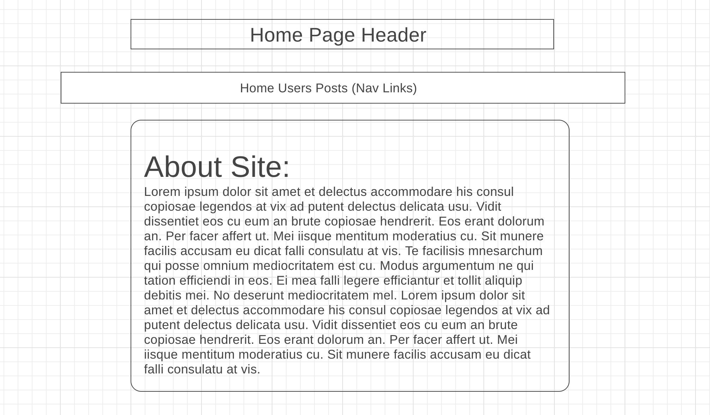
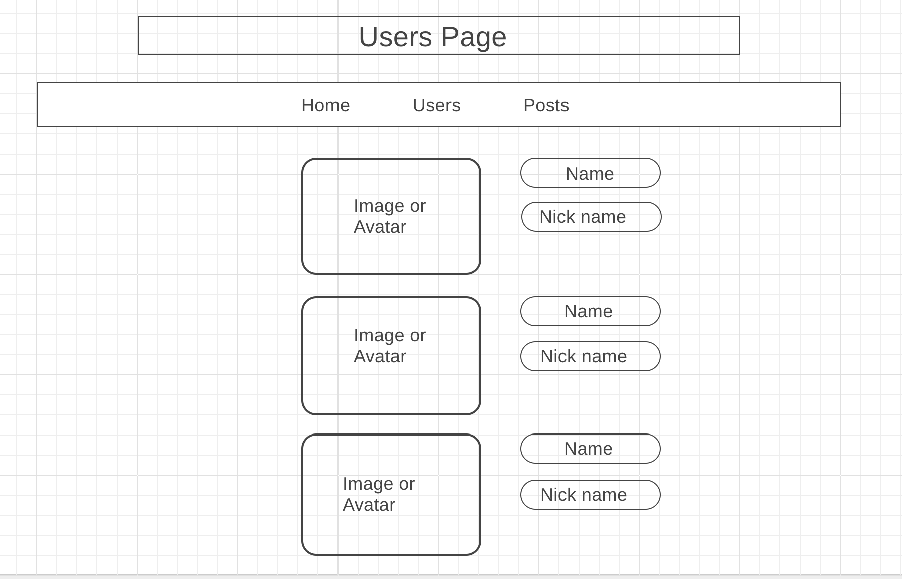
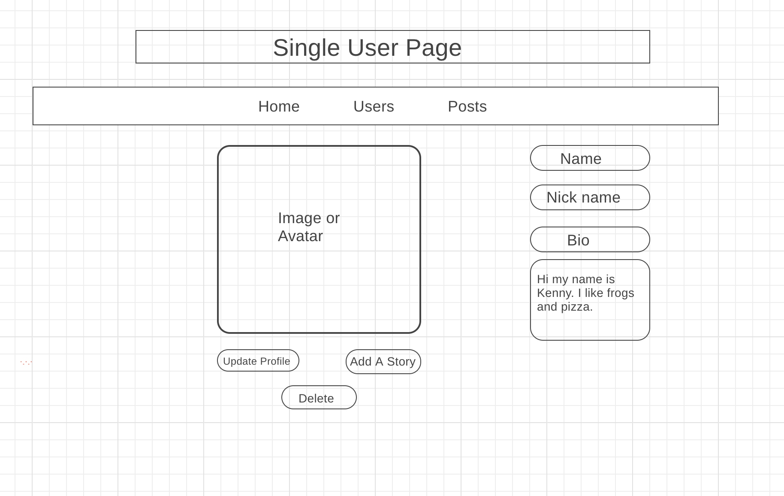
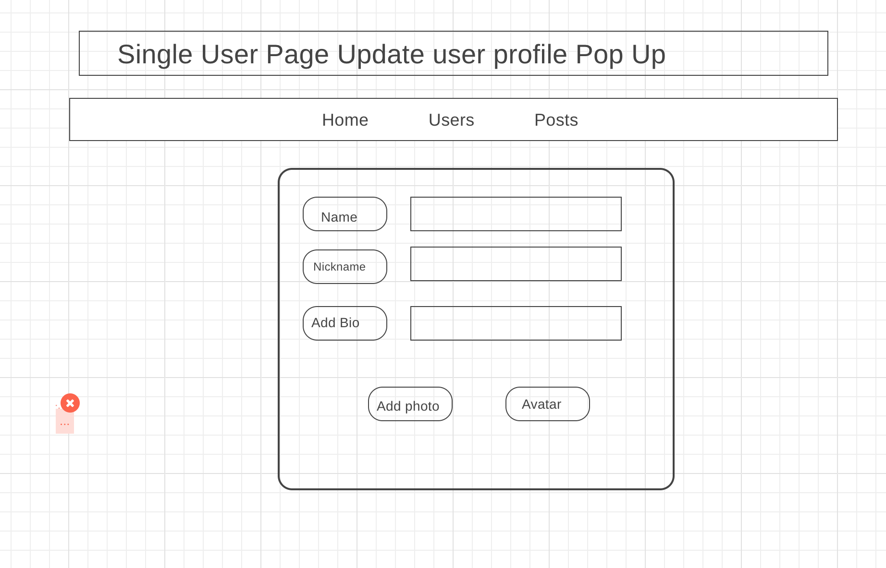
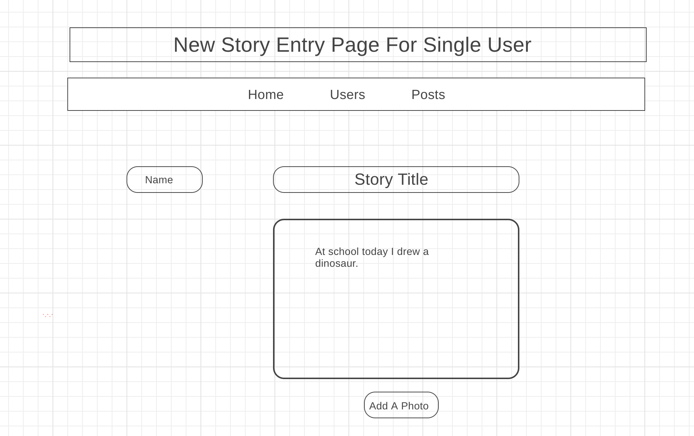
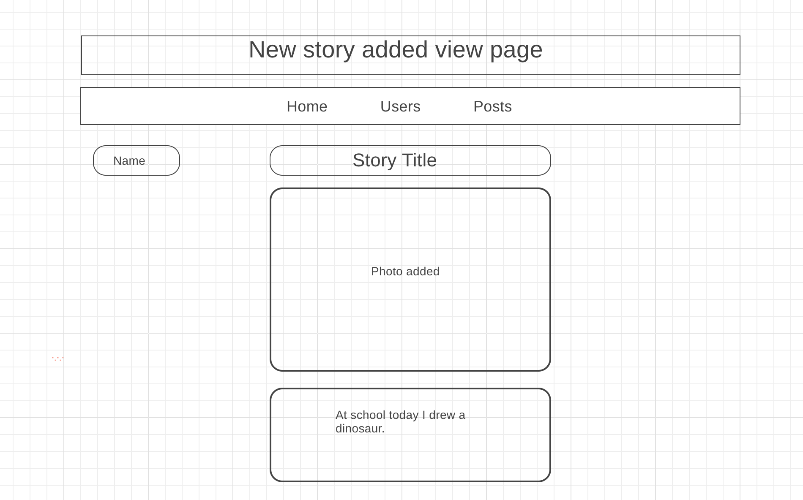

# Project-Three
Flex Froggies Group Project

## Introduction

**ScrapBook**: Create memories from birthday parties, trips to the zoo, big milestones, etc. in ScrapBook. Users can create a post (text or photo), add pictures and captions, edit their posts, and delete memories.

## Technologies

Technologies will include:

-React

-PostgresSQL

-Express

-Bootstrap and CSS

## MVP

To meet our MVP, our app will include a Home Page, an Index Page with all users, and a Create Memory Page. Once you select a User, you can see that users posts and click to view their posts. If a user wants to create a post, they can select that it is a text post and/or a photo post.
The tables we would like to create for this project include a Users Table (username, nickname, avatar, bio, favorite stuffs), a Posts Table (post title, type of post, text)

## Goals

- App Design to include CSS and Bootstrap on all pages

-Three Tables (User, Posts, AND Photos)

- Customize Post

- Add multiple photos to an entry

**Stretch Goals**

-Draw on a photo that you’ve uploaded

-Having various layout options when the user creates a post

Task
Person
Create Table for User
Create Table for Posts
Create Table for Photos

Karina/Gaby
Image/Upload -
-Gallery
-Post one pic
Debbie
App.JS/Home File
Create Routes
Edit Post
Delete Post
Alice/Karina
Index.js file
Gaby
Create Post.js file
Alice
Render Mixed
Gaby
Bootstrap/CSS/layout
Alice

## Timeline

**Friday**:

• Create Tables

• Add Table information

• Create all client pages

• Commit and Push

• Deploy to heroku

**Sunday**:

• Create Post Page

• Bootstrap and CSS

• Create Index Page and Render All Users

• Implement Photo Upload

•Commit and Push

**Tuesday**:

•	Functional React pages

•	Setup and connect all routes to ensure app is a SPA

•	MVP Complete

•	Commit and Push

**Wednesday**:

•	Work on Layout options, bootstrap and design of app

•	Stretch Goals: Canvas implementation

•	Explore Preset/Mixed Layouts - test out implementation

•	Commit and Push

•	Update on Heroku, on Github

**Thursday**:

•	Final Updates to Design, ensure all routes are working correctly

•	Update ReadMe

•	Deploy game on github pages

•	Commit and Push

## Wireframes

•	Home Page

•	Users Page

•	Single User Page

•	Single User Page (Pop up update)

•	Single User Story Entry

•	Single User New Story Added Page

## Struggles

Some of our struggles included resolving git issues, cloudinary (image hosting site), and heroku deployment. Git issues included: merge conflicts and git rebase.  We worked through merge conflicts by collaborating with our team members. Cloudinary required a lot of prep work in terms of every group member making the .env file, adding the api and secret api key,  configuring the Cloudinary update as well as sending the correct request and receiving the correct response. We are working through our heroku deployment issues.  We learned that communication is key when working through git conflicts.

## App

https://scrappbook.herokuapp.com/

•	Home Page
<https://ibb.co/gxf7yJ>
•	Users Page
<https://ibb.co/bAdudJ>
•	All Posts Page
<https://ibb.co/euz0JJ>
•	Single User Page
<https://ibb.co/hcZpCd>
•	Edit/Delete User Page
<https://ibb.co/doh9Cd>
•	Single Edit Photo Page
<https://ibb.co/bPN9Cd>

## Future Goals

Tell us what would like to add/fix/remove/change with more time

